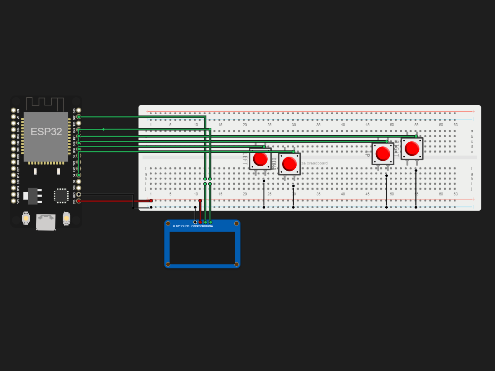

# An ESP 32 based snake game.

> Built in [Breadboard](https://breadboard.hackclub.com), a Hack Club program. This project took ~5.6 hours of work.

## What It Does

Well its an esp32 based og snake game that keeps the player ocupied. so basically the user needs to eat fruits to gain length and to not die they must like not crash into the boundary or into themselves..... and my first breadboard project!!!!

## How It Works

***BTW--> The circuit is captured in `breadboard-project.json`, and the firmware that runs it is in the `firmware/` folder.***

The game runs on an ESP32 and displays everything on a 128x64 OLED display over I2C. The snake moves around the screen eating food and grows longer every time it eats. If it hits the wall or itself the game ends and your score is shown.
The four push buttons are connected to GPIO 5, 4, 18 and 19 using the ESP32's internal pull-up resistors so no extra resistors are needed. The firmware constantly checks the buttons and changes the snake's direction whenever one is pressed.
To make the controls feel smooth the firmware uses software debouncing and runs the OLED at 400kHz I2C instead of the default 100kHz. The display is also only updated when needed instead of every loop which makes the button response much faster and the game feel a lot more responsive.

**(BTW DUE TO ISSUES IN THE SIMULATOR THE BUTTON CLICKS ARE ONLY REGISTERED WHEN YOU CLICK THEM LIKE 4-5 TIMES QUICKLY ITS NOT A CODE OR A WIRING ISSUE)**

## How To Use It

# Hardware Setup

This project uses an ESP32 Dev Module, a 0.96" I2C OLED display (SSD1306) and 4 push buttons. I built mine on a breadboard because it made the wiring much easier (and also i messed up the gnd connections without the breadboard)

## Step 1 - Place everything

First place the ESP32 on the breadboard. Then place the OLED display and all 4 push buttons. Make sure every push button sits across the middle gap of the breadboard otherwise it wont work properly.

## Step 2 - Connect the OLED

Connect the OLED like this.

VCC -> 3.3V on the ESP32

GND -> GND on the ESP32

SDA -> GPIO 21

SCL -> GPIO 22

## Step 3 - Connect the buttons

Each button needs one side connected to GND and the other side connected to a GPIO pin.

UP Button -> GPIO 5

DOWN Button -> GPIO 4

LEFT Button -> GPIO 18

RIGHT Button -> GPIO 19

The other leg of **every** button goes to the breadboard GND rail. Then connect the GND rail back to one of the ESP32 GND pins.

Since the code uses `INPUT_PULLUP` you dont need any external resistors.

## Step 4 - Double check everything

Before powering it on check all the wiring once again. Make sure:

- SDA really goes to GPIO 21.
- SCL really goes to GPIO 22.
- Every button has one leg connected to GND.
- Every button goes to the correct GPIO pin.
- There are no loose jumper wires.

# Flashing the Firmware

Open the project in Arduino IDE.

Install these libraries if you havent already.

- Adafruit GFX
- Adafruit SSD1306

Now select your board.

Tools -> Board -> ESP32 Dev Module

Select the correct COM port then click **Upload**.

Wait for the code to compile and upload. Once its done the ESP32 will restart automaticly.

# How to Play

When the ESP32 turns on you'll see the start screen.

Press **any** button to start the game.

Use the four buttons to control the snake.

Eat the food to grow longer and increase your score.

Dont hit the walls and dont crash into yourself otherwise its game over.

After the game ends just press any button again to start another game.

## Demo

- **Simulate it live:** [https://breadboard.hackclub.com/share/114](https://breadboard.hackclub.com/share/114), runs the firmware in the Breadboard simulator
- **View the design:** [https://taniwankenobi.github.io/breadboard-plays/p/114/](https://taniwankenobi.github.io/breadboard-plays/p/114/)

## Schematic

The editor snapshot is in `breadboard-project.json`.

## Bill of Materials

| Part | Quantity |
| --- | --- |
| breadboard-full | 1 |
| pushbutton | 4 |
| ssd1306-i2c | 1 |

## Firmware

Firmware files are in the `firmware/` folder.

## Build Journal

Build journal entries are kept in [`journals.md`](journals.md).

---

*Made in [Breadboard](https://breadboard.hackclub.com) — 5.6h of work*

